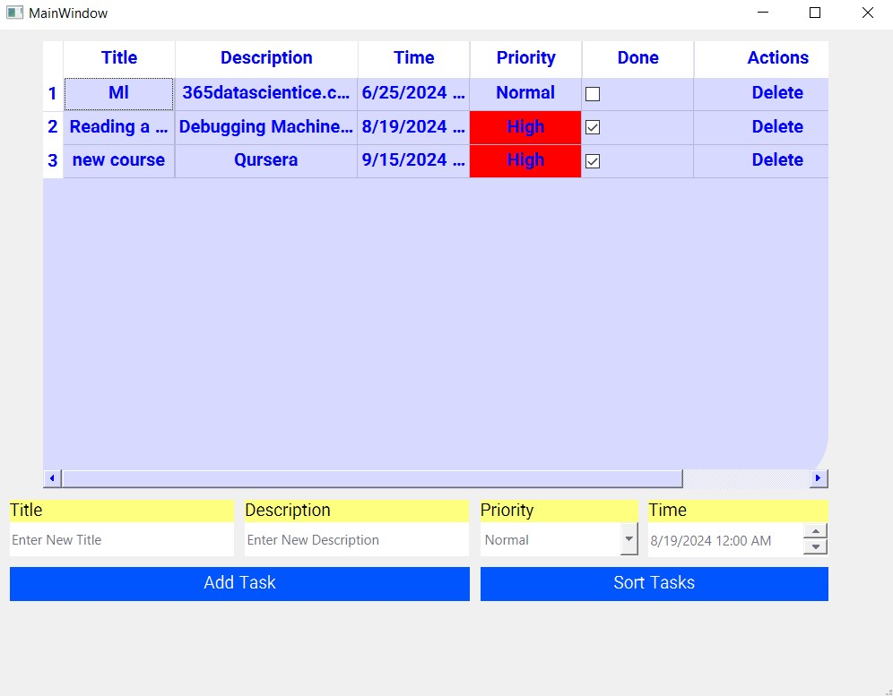

# Task Management Application

This Python application provides a user-friendly interface for managing your daily tasks. Key features include:

## Features
1- Task Creation and Management: Add new tasks with titles, descriptions, due dates, and priorities.\
2- Task Completion: Mark tasks as completed and view progress.\
3- Task Prioritization: Assign priorities (high, normal, low) to tasks, visually represented by different colors.\
4- Task Deletion: Remove unwanted tasks.\
5- Sorting: Tasks are automatically sorted with completed tasks at the bottom.\
6- Detailed View: Click on a task to see its complete details.\
7- User-Friendly Interface: Enjoy a visually appealing and intuitive design.\

Built with: Python, PySide6, SQLite

## How To run?

Install required libraries:
```bash
pip install pyside6
Run main.py
```
Note: To create an executable (.exe) file for Windows, use PyInstaller
```bash
pyinstaller main.py
```